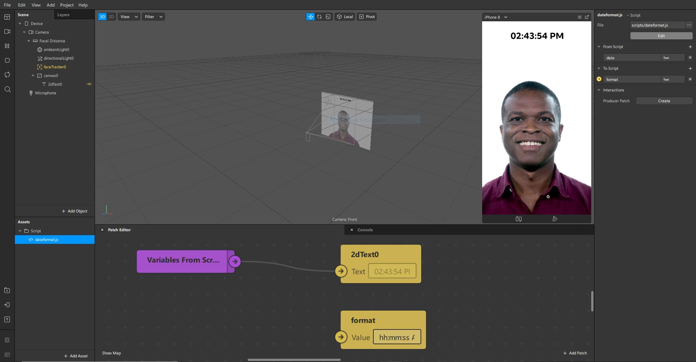

# SparkFormatDate
Script para formatação de data para o Spark AR Studio.

## Descrição
Este script em JavaScript foi desenvolvido para facilitar a obtenção e formatação de datas e horas no Spark AR Studio. Ele fornece variáveis que contêm informações de data e hora, permitindo a formatação desses dados em vários formatos para serem usados nos filtros do Spark AR.

## Tecnologias Utilizadas
- JavaScript

## Funcionalidades
Este script simplifica a obtenção de informações de data e hora no Spark AR Studio, oferecendo a capacidade de formatar esses dados em diferentes estilos. Você pode utilizar essas informações para gerar textos dinâmicos, criar lógica baseada em datas e horas, ou até mesmo criar contagens regressivas dentro dos seus filtros.

## Contato
Se tiver dúvidas ou precisar de mais informações, sinta-se à vontade para entrar em contato:
- Email : [contato@daanrox.com](mailto:contato@daanrox.com)
- LinkedIn: [https://www.linkedin.com/in/daanrox/](Daanrox)

---

Este projeto segue um padrão baseado no modelo utilizado no Bootcamp de Desenvolvimento Fullstack na Kenzie Academy.
